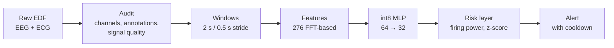

<div align="center">

# Prediction-Lite

**TinyML seizure early warning — from a published pilot to multimodal, personalized monitoring**


*MS thesis work · Electrical & Computer Engineering · The University of Texas at Dallas*

</div>

---

## Overview

Prediction-Lite turns EEG into a continuous **seizure-risk signal** that runs on a microcontroller. A compact int8 classifier scores 2-second windows; a temporal risk layer (smoothing → risk fusion → firing power → z-score → cooldown) turns those noisy scores into stable early-warning alerts.

The method was published at **IEEE ISVLSI 2026** using the CHB-MIT dataset. This repository holds that published pipeline, frozen, and the work that extends it:

- **More data** — porting the pipeline to the Siena and SeizeIT2 datasets
- **ECG fusion** — comparing EEG-only, ECG-only, and EEG + ECG
- **Personalization** — per-patient calibration toward a digital-twin signature



---

## Published results (CHB-MIT, 4 bipolar channels)

| Metric | Float32 | **Int8 (deployed)** |
|---|---|---|
| Accuracy | 91.19% | **91.49%** |
| AUC | 0.93 | **0.93** |
| Classifier latency | 9 ms | **2 ms** |
| Classifier RAM | 2.6 KB | **1.7 KB** |
| Classifier flash | 88.2 KB | **33.6 KB** |

The exact code that produced these numbers is tagged **`isvlsi-2026`**:

```bash
git checkout isvlsi-2026
```

---

## Repository structure

```
.
├── README.md
├── .gitignore
└── experiments/
    ├── isvlsi2026-chbmit/          # Published pipeline — frozen, do not modify
    │   ├── 1_trim_and_label_samples.py
    │   ├── 2_clean_double_header.py
    │   ├── 3_balanced_dataset.py
    │   ├── 4_seizure_prediction_v7.py
    │   ├── 5_multi_subject_risk_comparison.py
    │   ├── chbmit_balanced_trimmed/    # exact training set (see note below)
    │   └── EI_model_export/            # deployed Edge Impulse model
    │
    ├── siena_data_audit/           # Siena: EEG + ECG audit tools
    │   ├── siena_audit.py
    │   └── check_ekg.py
    │
    └── seizeit2_data_audit/        # SeizeIT2: catalogue, download, audit
        ├── 1_seizeIT2_catalog.py
        ├── 2_seizeIT2_download.py
        ├── 3_dataset_audit.py
        └── seizeit2_meta/
            ├── seizures.csv        # every seizure in the dataset
            └── recordings.csv      # every recording, with ECG availability
```

> **Why the CHB-MIT training CSVs are committed:** `3_balanced_dataset.py` samples non-seizure windows with an unseeded `random.sample()`. Re-running it produces a *different* training set, so `chbmit_balanced_trimmed/` is the only record of what the published model was trained on.

---

## Datasets

Raw recordings are **never committed**. Keep them outside the repo and point each script's `CONFIG` block at them.

| | **CHB-MIT** | **Siena** | **SeizeIT2** |
|---|---|---|---|
| Population | 22 pediatric / young adult | 14 adults | 125 adults, focal epilepsy |
| Seizures | 198 | 47 | 883 |
| EEG | Scalp, bipolar | Scalp, 29 ch (10-20) | Behind-the-ear, 2 ch (wearable) |
| ECG | **No** | Yes (1 ch) | Yes (1 ch, wearable) |
| Sampling rate | 256 Hz | 512 Hz | 256 Hz |
| Role here | Published baseline | EEG arm, same montage as paper | ECG + fusion arms at scale |
| Source | [PhysioNet](https://doi.org/10.13026/C2K01R) | [PhysioNet](https://doi.org/10.13026/5d4a-j060) | [OpenNeuro ds005873](https://openneuro.org/datasets/ds005873) |

---

## Getting started

### 1. Environment

```bash
python3 -m venv venv
source venv/bin/activate
pip install numpy pyedflib            # audit tools (no SciPy needed)
```

Extra requirements for the frozen CHB-MIT experiment: `pandas`, `scipy`, `matplotlib`, and `edge_impulse_linux` (the scripts stub out `pyaudio` so it imports), plus the `.eim` model in `EI_model_export/`. The `.eim` is a macOS ARM build.

> **macOS note:** if MNE fails with a SciPy `dlopen` error, run
> `pip install --upgrade --force-reinstall --no-cache-dir numpy scipy`.

### 2. Configure

Every script has a `CONFIG` block at the top. There are no command-line arguments — edit the paths and settings there, then run the script.

### 3. Run

**SeizeIT2** — in order, from `experiments/seizeit2_data_audit/`:

```bash
python 1_seizeIT2_catalog.py      # annotations only: builds seizures.csv, suggests a pilot
python 2_seizeIT2_download.py     # DRY_RUN = True first: reports size; then False to download
python 3_dataset_audit.py         # per-seizure ECG + EEG quality in the pre-ictal window
```

**Siena** — from `experiments/siena_data_audit/`:

```bash
python siena_audit.py             # montage, EKG presence, seizure offsets, annotation errors
python check_ekg.py               # EKG quality: R-peaks, mains, saturation, notch recovery
```

---

## Findings so far

<details>
<summary><b>Siena</b> — 7 of 14 subjects audited</summary>

- All 17 audited files contain the 6 electrodes needed for the 4 bipolar pairs.
- 13 of 14 subjects are temporal-lobe epilepsy, so a localization study is not possible on this dataset.
- ECG: 5 of 7 subjects have at least one clean file; 6 of 7 are usable after cleaning.
- ECG issues found: 50 Hz mains (up to 91% of power), DC offsets from −10 to +165 mV, ~15 µV/bit resolution, effective sampling as low as 138 Hz.
- Annotation errors: PN00-3 lists a 61-min seizure in a 42-min file; PN06 maps seizures to the wrong files. Seizure-list text files are unreliable — the EDF header is the source of truth.

</details>

<details>
<summary><b>SeizeIT2</b> — full catalogue + 4-subject pilot</summary>

- 125 subjects, 2,850 recordings, 11,627 hours, 883 seizures — matching the dataset paper.
- 759 seizures have a clean 4-minute pre-ictal window and ECG present.
- Onset lobes span temporal, frontal, central, parietal, occipital and insular — the localization study is feasible here.
- Pilot: sub-073, sub-087, sub-002, sub-103 (2.9 GB, EEG + ECG only).
- Audit v1: 72 of 147 pilot seizures usable. v2 adds per-window EEG artifact rejection, an EEG mains notch, and lead/cluster seizure labels.

</details>

---

## Known limitations of the frozen pipeline

The `isvlsi-2026` code is preserved as published. These issues are being fixed in the refactor, not in the frozen copy:

| Issue | Effect |
|---|---|
| Alert logic only runs within 10 min before known seizures | False alarms elsewhere are never counted; seizure-free files score 0 FA/hr |
| Model evaluated on the same subjects it was trained on | Performance is in-sample |
| Spectral features normalized over the whole file | Uses future data; not runnable live |
| `COOLDOWN = 300` compared against window indices | Actual cooldown is 150 s |

---

## Roadmap

- [x] Freeze and tag the published pipeline
- [x] Siena audit tools
- [x] SeizeIT2 catalogue, downloader, and audit
- [ ] Refactor into a reusable `prediction_lite/` package
- [ ] Causal risk layer, full-recording alerts, leave-one-subject-out evaluation
- [ ] Re-run CHB-MIT under the corrected evaluation (honest baseline)
- [ ] EEG-only vs. ECG-only vs. EEG + ECG comparison
- [ ] Localization-distribution study (SeizeIT2)
- [ ] Per-patient digital-twin calibration

---

## Team

| | Focus |
|---|---|
| **Sumit Kumar** | Thesis owner · datasets, pipeline, evaluation |
| **Krutika** | Digital-twin AI agent architecture |
| **Jennah** | ECG analysis and literature review |

---

## Citation

If you use this work, please cite the paper:

```bibtex
@inproceedings{kumar2026predictionlite,
  title     = {Prediction-Lite: A TinyML Framework for Temporal Risk-Aware
               Seizure Early Warning on Edge Devices},
  author    = {Kumar, Sumit and Thota, Yogeswar Reddy and Noffel, Jennah Y.
               and Nikoubin, Tooraj},
  booktitle = {IEEE Computer Society Annual Symposium on VLSI (ISVLSI)},
  year      = {2026}
}
```

<details>
<summary><b>Dataset citations</b></summary>

- **CHB-MIT** — Guttag, J. (2010). *CHB-MIT Scalp EEG Database* (v1.0.0). PhysioNet. https://doi.org/10.13026/C2K01R
- **Siena** — Detti, P. (2020). *Siena Scalp EEG Database* (v1.0.0). PhysioNet. https://doi.org/10.13026/5d4a-j060
  Detti, P., Vatti, G., & Zabalo Manrique de Lara, G. (2020). EEG synchronization analysis for seizure prediction: A study on data of noninvasive recordings. *Processes*, 8(7), 846.
- **SeizeIT2** — Bhagubai, M., Chatzichristos, C., Swinnen, L., et al. (2025). SeizeIT2: Wearable dataset of patients with focal epilepsy. *Scientific Data*, 12, 1228. https://doi.org/10.1038/s41597-025-05580-x
  Dataset: https://doi.org/10.18112/openneuro.ds005873.v1.1.0
- **PhysioNet** — Goldberger, A. L., et al. (2000). PhysioBank, PhysioToolkit, and PhysioNet. *Circulation*, 101(23), e215–e220.

</details>

---

## License

Code license to be decided. Each dataset is distributed under its provider's own license — check the dataset pages above before redistributing any derived data.